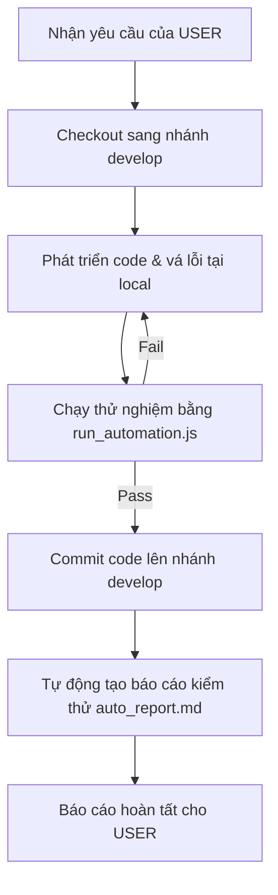

# Hệ thống Quản lý và Tự động hóa Dự án ERP Mini (100% Automatic Project Manager)

Skill này cung cấp các hướng dẫn và kịch bản tự động hóa giúp AI Agent quản lý, kiểm thử, đối soát và tích hợp mã nguồn của dự án ERP Mini một cách hoàn hảo và an toàn tuyệt đối.

---

## 🛠️ 1. Các lệnh tự động hóa cốt lõi

Tất cả các lệnh quản lý đều được đóng gói trong script chạy nhanh qua Node.js:
- **Đường dẫn script**: `node .agents/skills/auto-project-manager/scripts/run_automation.js`

### Cách sử dụng:
1.  **Quét & Kiểm tra toàn bộ dự án**:
    ```bash
    node .agents/skills/auto-project-manager/scripts/run_automation.js --all
    ```
2.  **Chỉ chạy Unit Tests**:
    ```bash
    node .agents/skills/auto-project-manager/scripts/run_automation.js --vitest
    ```
3.  **Chỉ chạy E2E Tests (Playwright)**:
    ```bash
    node .agents/skills/auto-project-manager/scripts/run_automation.js --playwright
    ```
4.  **Chỉ chạy Build kiểm thử**:
    ```bash
    node .agents/skills/auto-project-manager/scripts/run_automation.js --build
    ```

---

## 📂 2. Quy trình làm việc tự động (Autopilot Workflow)

Khi người dùng yêu cầu sửa lỗi hoặc viết tính năng mới, Agent sẽ tuân thủ nghiêm ngặt quy trình tự động sau:



### Bước 1: Chuẩn bị môi trường & Chuyển nhánh
Luôn đảm bảo đang ở nhánh `develop` trước khi viết code.

### Bước 2: Viết code & Cập nhật logic
Chỉnh sửa các component hoặc logic theo yêu cầu.

### Bước 3: Chạy Script Tự động hóa (`run_automation.js`)
Lệnh này sẽ tự động:
1.  Chạy `git status` để kiểm tra các file thay đổi.
2.  Chạy `vitest` để đảm bảo không lỗi logic kế toán, kho hàng.
3.  Chạy `playwright` để kiểm tra giao diện người dùng (Desktop & Mobile).
4.  Chạy `npm run build` để kiểm tra lỗi biên dịch TypeScript/Vite.
5.  Xuất file báo cáo [auto_report.md](file:///C:/Users/pkhoa/.gemini/antigravity/brain/e572c9fa-8149-43a3-940b-5456bbfcec6a/auto_report.md) vào thư mục Artifacts của cuộc hội thoại để làm bằng chứng xác thực.

### Bước 4: Commit & Báo cáo
Gửi báo cáo trực quan cho người dùng kèm link chi tiết kết quả.
