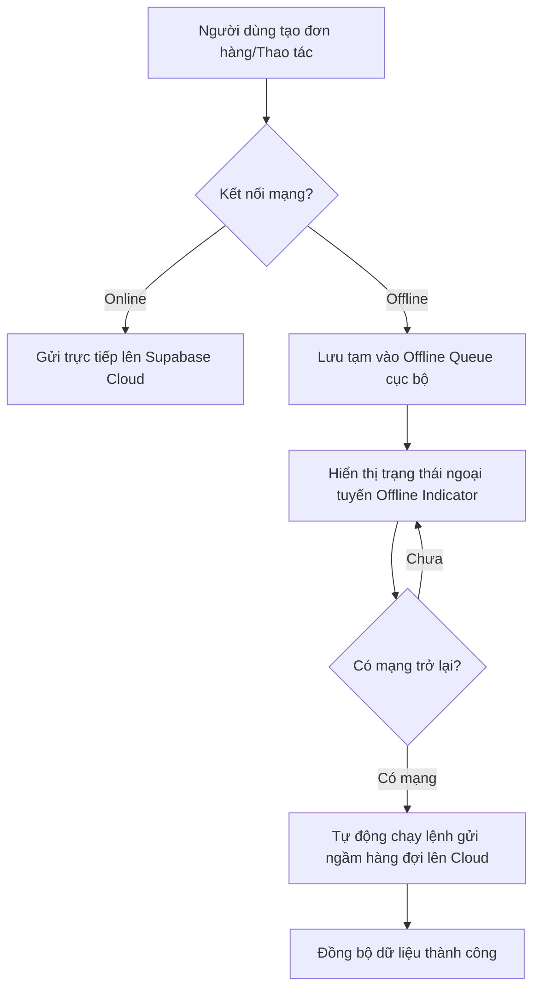

# Hướng Dẫn Vận Hành & Quản Trị Hệ Thống (Admin Guide)

Tài liệu này dành cho Quản trị viên (Admin) dự án **ERP Mini & Pancake POS**, hướng dẫn cấu hình, quản lý tài khoản, đồng bộ dữ liệu Cloud Supabase, cơ chế lưu trữ và quy trình chạy kiểm thử tự động.

---

## 1. Tổng Quan Cơ Chế Hoạt Động (Local Demo vs Supabase Mode)

Hệ thống được thiết kế để hoạt động song song ở hai chế độ lưu trữ hoàn toàn độc lập:

| Đặc tính | Chế độ Local Demo | Chế độ Supabase Remote |
| :--- | :--- | :--- |
| **Tài khoản đăng nhập** | Sử dụng thông tin mặc định: `admin_demo` / `admin_demo`. | Đăng ký tài khoản email thật / mật khẩu tùy chọn. |
| **Nơi lưu dữ liệu** | `window.localStorage` của trình duyệt đang dùng. | Database PostgreSQL trên Cloud Supabase (`lccxomvabyvkinzzbysg`). |
| **Yêu cầu Internet** | Hoàn toàn không cần mạng (Offline 100%). | Cần mạng để tải và cập nhật dữ liệu (hỗ trợ lưu tạm offline). |
| **Khả năng đồng bộ** | Dữ liệu cục bộ không tự đồng bộ lên Cloud Supabase. | Đồng bộ thời gian thực (real-time) và tự động đồng bộ khi khôi phục mạng. |

---

## 2. Hướng Dẫn Đồng Bộ Database & Cấu Hình Môi Trường

Khi triển khai lên một môi trường mới hoặc cập nhật cấu trúc bảng (schema), admin cần thực hiện đồng bộ migrations lên Supabase Cloud.

### Bước 2.1: Thiết lập biến môi trường
Tạo tệp `.env` tại thư mục gốc dự án từ `.env.example` và điền thông tin kết nối Supabase của bạn:
```env
VITE_SUPABASE_URL=https://lccxomvabyvkinzzbysg.supabase.co
VITE_SUPABASE_PUBLISHABLE_KEY=your_publishable_anon_key_here
```

### Bước 2.2: Liên kết dự án với Supabase CLI
Chạy lệnh liên kết tới remote project ref `lccxomvabyvkinzzbysg`:
```bash
npx supabase link --project-ref lccxomvabyvkinzzbysg
```
*(Hệ thống sẽ yêu cầu nhập mật khẩu Database của dự án)*

### Bước 2.3: Đẩy dữ liệu cấu trúc bảng lên Cloud (Push Migrations)
Để áp dụng toàn bộ các thay đổi cơ sở dữ liệu (bao gồm cả bảng giao dịch ngân hàng `bank_transactions` mới cập nhật):
```bash
npx supabase db push
```

### Bước 2.4: Tạo lại định nghĩa kiểu dữ liệu TypeScript (Generate Types)
> [!CAUTION]
> Tránh chạy lệnh trực tiếp bằng toán tử redirection `>` trên Windows PowerShell vì PowerShell sẽ lưu tệp dưới định dạng `UTF-16LE` gây lỗi biên dịch.
> Hãy sử dụng tập lệnh Node.js sau để đảm bảo file ghi dưới dạng mã hóa `UTF-8` tiêu chuẩn:

```bash
node -e "const { execSync } = require('child_process'); const fs = require('fs'); const output = execSync('npx supabase gen types typescript --linked'); fs.writeFileSync('src/integrations/supabase/types.ts', output, 'utf8');"
```

---

## 3. Quản Lý Tài Khoản Admin & Xác Thực (Auth Settings)

Khi chạy ở môi trường thực tế (Supabase Mode), quản trị viên cần đăng ký tài khoản mới và cấu hình xác thực.

### Bước 3.1: Đăng ký tài khoản trên giao diện Web
1. Mở trình duyệt chạy local (mặc định: `http://localhost:5173`).
2. Tại màn hình Đăng nhập, chọn liên kết **Đăng ký** (Sign Up).
3. Nhập Email và Mật khẩu mong muốn rồi chọn đăng ký.

### Bước 3.2: Kích hoạt tài khoản ngay lập tức (Bỏ qua xác thực Email)
Mặc định Supabase sẽ yêu cầu người dùng nhấp vào link trong email kích hoạt. Để bỏ qua bước này trong quá trình thử nghiệm hoặc phát triển, Admin có 2 cách xử lý:

* **Cách 1: Xác nhận thủ công từ Supabase Dashboard**
  1. Truy cập vào trang quản trị người dùng: [Supabase Auth Users](https://supabase.com/dashboard/project/lccxomvabyvkinzzbysg/auth/users).
  2. Tìm email bạn vừa đăng ký (đang ở trạng thái *Waiting for verification*).
  3. Nhấp vào dấu **3 chấm** ở cuối hàng của User đó ➔ Chọn **Confirm User** (Xác nhận người dùng). Tài khoản sẽ được kích hoạt ngay lập tức.

* **Cách 2: Tắt tính năng bắt buộc xác thực email (Khuyên dùng khi Dev/Test)**
  1. Vào mục cấu hình: [Supabase Auth Providers Settings](https://supabase.com/dashboard/project/lccxomvabyvkinzzbysg/auth/providers).
  2. Chọn phần cấu hình **Email**.
  3. Tắt (Disable) mục **Confirm email** (Xác thực email).
  4. Nhấn **Save**. Sau khi tắt, bất kỳ tài khoản mới nào đăng ký cũng có thể đăng nhập trực tiếp mà không cần check email.

---

## 4. Cơ Chế Đồng Bộ Ngoại Tuyến (Offline Sync Queue)

Hệ thống ERP Mini được trang bị cơ chế tự động phục hồi và xử lý lỗi kết nối mạng cực kỳ mạnh mẽ dành riêng cho chế độ Supabase:



* **Trạng thái lưu trữ:** Dữ liệu ngoại tuyến được lưu tại hàng đợi cục bộ.
* **Xử lý xung đột (Conflict Resolution):** Nếu cùng một bản ghi bị chỉnh sửa đồng thời ở cả local khi offline và trên cloud, hệ thống sẽ mở hộp thoại **Sync Conflict Dialog** để admin chọn ghi đè hoặc giữ nguyên bản ghi Cloud.

---

## 5. Quy Trình Chạy Kiểm Thử & Xác Thực Toàn Diện

Admin hoặc bộ phận QA/QC có thể thực hiện kiểm tra chất lượng phần mềm thông qua các công cụ tích hợp sẵn:

### 5.1. Kiểm tra tĩnh (Static Check & Typecheck)
Kiểm tra cú pháp lập trình và tính nhất quán của các kiểu dữ liệu TypeScript:
```bash
npm run typecheck
```

### 5.2. Chạy Kiểm thử Đơn vị & Tích hợp (Vitest)
Chạy 386 kịch bản kiểm thử logic nghiệp vụ tự động (tồn kho combo BOM, chiết khấu sỉ, thanh toán đối soát,...):
```bash
npx vitest run
```

### 5.3. Chạy Kiểm thử Luồng Giao diện E2E (Playwright)
Mô phỏng 22 luồng hành vi của khách hàng và nhân viên trên trình duyệt thật:
* **Chạy ẩn danh (Headless):**
  ```bash
  npx playwright test
  ```
* **Chạy có giao diện điều khiển (UI Mode):**
  ```bash
  npx playwright test --ui
  ```

### 5.4. Quy trình tự động hóa tích hợp (Auto Project Manager Pipeline)
Chạy toàn bộ quy trình kiểm thử từ đầu đến cuối trước khi build phát hành bản chính thức:
```bash
node .agents/skills/auto-project-manager/scripts/run_automation.js --all
```
*(Báo cáo tổng hợp sau khi chạy thành công sẽ được xuất ra file `.agents/auto_report.md`)*
