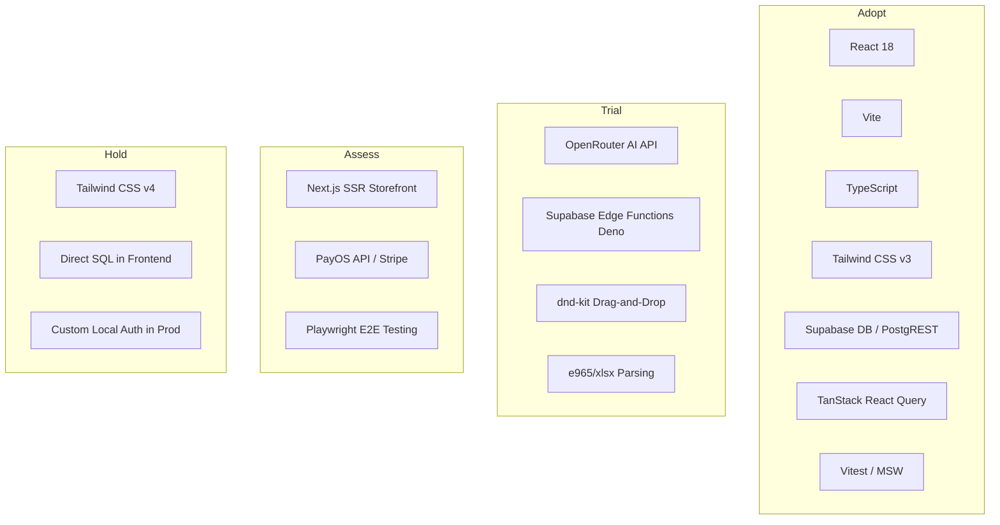

# Technology Radar

Project: Multi Sale Organizer
Profile: webapp
Goal: Bản đồ phân loại công nghệ và định hướng kiến trúc kỹ thuật của hệ thống.

---

## 1. Vòng tròn Công nghệ (Technology Rings)

Chúng tôi phân loại công nghệ thành 4 trạng thái cốt lõi:

*   **ADOPT (Áp dụng)**: Các công nghệ lõi, đã được kiểm chứng tính ổn định, có độ phủ rộng trong dự án và là lựa chọn mặc định.
*   **TRIAL (Thử nghiệm)**: Công nghệ đang được triển khai thử nghiệm ở một số phân hệ phụ trợ, cho thấy tiềm năng lớn nhưng cần tích lũy thêm kinh nghiệm vận hành.
*   **ASSESS (Đánh giá)**: Các giải pháp đang được nghiên cứu hoặc xem xét tích hợp trong tương lai gần nhằm nâng cao tính năng sản phẩm.
*   **HOLD (Hạn chế / Tạm dừng)**: Các công nghệ không được áp dụng thêm, đang chuẩn bị thay thế hoặc cấm sử dụng vì lý do bảo mật / kiến trúc.

---

## 2. Chi tiết phân nhóm Công nghệ

### ADOPT (Áp dụng)
*   **React 18 & Vite**: Nền tảng ứng dụng Single Page App (SPA) tốc độ tải nhanh, tối ưu hóa Hot Module Replacement (HMR) trong phát triển cục bộ.
*   **TypeScript**: Ép kiểu chặt chẽ toàn hệ thống để phát hiện lỗi từ sớm, đặc biệt hữu ích khi làm việc với schema động từ Supabase.
*   **Tailwind CSS v3 & shadcn/ui**: Xây dựng UI đồng bộ theo hệ thống Design System chuẩn, hỗ trợ giao diện responsive chuyên nghiệp.
*   **Supabase Database & PostgREST**: Đơn giản hóa kết nối trực tiếp frontend-to-database thông qua PostgREST client, tự động kế thừa cơ chế phân quyền Row Level Security (RLS).
*   **TanStack React Query**: Quản lý trạng thái cache dữ liệu từ xa, tự động làm mới (invalidate) khi đồng bộ hóa kênh bán hàng hoặc cập nhật thông tin đơn hàng.
*   **Vitest**: Runner chạy unit test siêu tốc, tích hợp trực tiếp với cấu hình Vite của dự án.

### TRIAL (Thử nghiệm)
*   **OpenRouter AI Gateway**: Kết nối linh hoạt đến các mô hình AI lớn (Gemini 2.5 Flash, Claude 3.5 Sonnet) với chi phí thấp và cơ chế fallback tự động về Lovable gateway khi lỗi.
*   **Supabase Edge Functions (Deno)**: Viết các webhook xử lý bất đồng bộ bằng TypeScript trên môi trường serverless phân tán toàn cầu, độc lập với server frontend.
*   **@dnd-kit/core & sortable**: Hỗ trợ tương tác kéo thả sắp xếp danh mục sản phẩm, thứ tự ưu tiên đơn hàng hoặc trạng thái Kanban linh hoạt.
*   **@e965/xlsx**: Thư viện phân tích file bảng tính Excel phía client gọn nhẹ phục vụ tính năng import đơn hàng loạt không gây quá tải cho máy chủ.

### ASSESS (Đánh giá)
*   **Next.js (SSR)**: Xem xét tách riêng phần Cửa hàng công khai (`/order`, `/tracking`) sang Next.js Server-Side Rendering để tối ưu hóa SEO và tốc độ hiển thị nội dung đầu tiên (FCP) cho người tiêu dùng cuối.
*   **PayOS & Stripe SDK**: Lên kế hoạch tích hợp đầy đủ SDK thanh toán để tự động hóa hoàn toàn quy trình kích hoạt subscription gói cước cho merchant.
*   **Playwright**: Đánh giá viết các kịch bản test trình duyệt thực tế (E2E) nhằm giả lập thao tác của merchant vượt qua các tình huống stress-test phức tạp.

### HOLD (Hạn chế / Tạm dừng)
*   **Tailwind CSS v4**: Tạm thời không nâng cấp lên phiên bản v4 do các xung đột tiềm tàng với bộ công cụ biên dịch css hiện tại và sự thiếu ổn định của một số thư viện shadcn/ui thế hệ cũ.
*   **Ghi đè SQL trực tiếp từ Frontend**: Nghiêm cấm viết các câu lệnh SQL tự do bỏ qua lớp bảo vệ RLS hoặc không thông qua hàm định nghĩa sẵn (RPC / Functions) để tránh rò rỉ dữ liệu của doanh nghiệp khác.
*   **Custom Local Auth trong Production**: Các chức năng đăng nhập tài khoản demo (`admin/admin`) chỉ được kích hoạt ở môi trường local smoke test, bắt buộc sử dụng Supabase Auth thật khi chạy online để đảm bảo an toàn danh tính.
