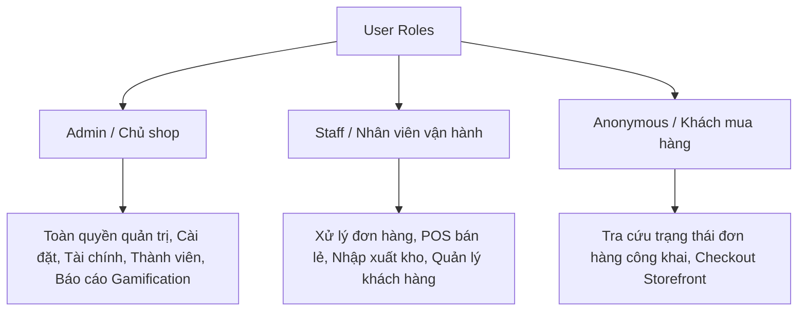

# UX/UI Flow Map

Project: Multi Sale Organizer
Profile: webapp
Goal: Bản đồ tương tác, cấu trúc định hướng và luồng hoạt động chính dành cho các nhóm đối tượng người dùng.

---

## 1. Phân quyền Người dùng (User Roles)

Hệ thống phục vụ 3 nhóm đối tượng chính với quyền hạn khác nhau:



---

## 2. Cấu trúc Menu & Hướng trang (Site Navigation Map)

### ERP Trực quan (Phần đã Authenticated)
Toàn bộ thanh điều hướng chính nằm ở thanh Sidebar bên trái (`src/components/layout/Sidebar.tsx`):

- **Tổng quan (`/`)**: Hiển thị doanh thu thực tế, biểu đồ tăng trưởng đơn hàng, và các cảnh báo khẩn cấp (sắp hết hàng, đơn trễ).
- **POS bán lẻ (`/pos`)**: Giao diện bán trực tiếp tại quầy. Tìm kiếm nhanh sản phẩm, chọn khách hàng, chọn thanh toán và in hóa đơn tức thì.
- **Đơn hàng (`/orders`)**: Danh sách quản lý đơn hàng đa kênh. Hỗ trợ bộ lọc trạng thái, cập nhật thông tin vận chuyển, và import đơn từ Excel.
- **Kho & Sản phẩm (`/inventory`, `/warehouses`)**: Quản lý thuộc tính sản phẩm, tồn kho theo từng kho hàng vật lý, cảnh báo mức tồn kho tối thiểu.
- **Đối tác (`/partners`)**: Lưu trữ thông tin khách hàng, nhà cung cấp, kiểm tra công nợ và phân khúc khách hàng (RFM insights).
- **Lịch đặt (`/bookings`)**: Phục vụ các shop có mô hình hẹn lịch dịch vụ hoặc đặt trước hàng hóa đặc thù.
- **Data Hub (`/data-hub`)**: Dành riêng cho quản trị viên vận hành để giám sát kết nối API, webhook và khắc phục các sự kiện đồng bộ lỗi từ sàn Shopee, TikTok Shop.
- **Tài chính (`/finance`, `/accounting`)**: Nhật ký thu chi, quản lý dòng tiền và báo cáo công nợ nhà cung cấp.
- **Báo cáo hiệu suất (`/performance/*`)**: Dashboard KPI nhân viên, Gamification và báo cáo chiến lược phát triển.
- **Cài đặt hệ thống (`/settings`)**: Cấu hình thông tin doanh nghiệp, phương thức vận chuyển, mã giảm giá và cài đặt AI kết nối qua OpenRouter.

### Giao diện công khai (Public Routes)
Không yêu cầu đăng nhập, bảo mật qua chính sách RLS an toàn:
- **Cửa hàng mua sắm (`/order`, `/public-order`)**: Đơn giản hóa quá trình tự checkout của khách.
- **Tra cứu đơn (`/tracking`, `/order-tracking`)**: Nhập số điện thoại và ID đơn hàng để xem tiến trình vận chuyển theo thời gian thực.

---

## 3. Các Luồng Nghiệp vụ Chính (Core Workflows)

### Luồng 1: Đồng bộ Đơn hàng & Xử lý lỗi (Platform Sync & Data Hub)
Đồng bộ đơn hàng từ sàn thương mại điện tử tự động thông qua Webhook hoặc kéo thủ công:

```txt
[Sàn TMĐT (Shopee/TikTok)] 
      │ (Webhook Ingest / API Sync)
      ▼
[Raw Events (Data Hub)] ──(Tự động kiểm tra chất lượng dữ liệu)──► [Lỗi dữ liệu (Data Quality Issues)]
      │                                                                    │
      │ (Hợp lệ)                                                           │ (Quản trị viên sửa lỗi / Retry)
      ▼                                                                    ▼
[Normalized Orders] ◄──────────────────────────────────────────────────────┘
```

1. Webhook nhận payload ghi nhận sự kiện thô vào `raw_events`.
2. Hệ thống kiểm tra chất lượng: nếu thiếu SĐT hoặc Địa chỉ, tạo bản ghi lỗi trong `data_quality_issues`.
3. Quản trị viên vào `/data-hub` để cập nhật thủ công thông tin thiếu và ấn **Retry**, đẩy đơn hàng hợp lệ vào bảng operational `orders`.

### Luồng 2: Nhập đơn hàng loạt từ file Excel (Excel Import Flow)
Tránh nhập tay cho các shop chuyển đổi dữ liệu từ hệ thống cũ:

1. Tại `/orders`, bấm **Import Đơn**.
2. Kéo thả file Excel (`.xlsx`, `.csv`). Giao diện tự động phân tích và khớp cột dữ liệu.
3. Chạy thuật toán **SKU Resolution** (khớp SKU sàn với mã sản phẩm trong kho) và **Identity Resolution** (khớp SĐT khách hàng cũ để gán ID).
4. Xem trước (Preview) danh sách đơn hàng đã chuẩn hóa.
5. Xác nhận lưu hàng loạt vào hệ thống.

### Luồng 3: Bán hàng tại quầy (POS Checkout Flow)
Tốc độ là ưu tiên tối đa:

1. Nhân viên chọn sản phẩm (hoặc quét mã vạch).
2. Hệ thống tự động tính tổng tiền, chiết khấu dựa trên voucher hoạt động.
3. Chọn khách hàng (mặc định là Khách vãng lai).
4. Chọn phương thức thanh toán (Tiền mặt, Chuyển khoản VietQR, Thẻ).
5. Bấm **Hoàn tất**: Tự động trừ tồn kho vật lý tại kho mặc định của chi nhánh, tạo bản ghi thu chi trong `accounting`, sinh mã đơn hàng tiền tố `POS-`.
